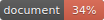

# `exectx-monorepo`

---

Check out the [wiki page for `exectx`](https://github.com/ludvigalden/exectx/wiki/exectx).

{{>main-index}}

## Authors

- Ludvig Aldén [@ludvigalden](https://github.com/ludvigalden)

---

[MIT License.](https://github.com/ludvigalden/exectx/blob/main/LICENSE)
